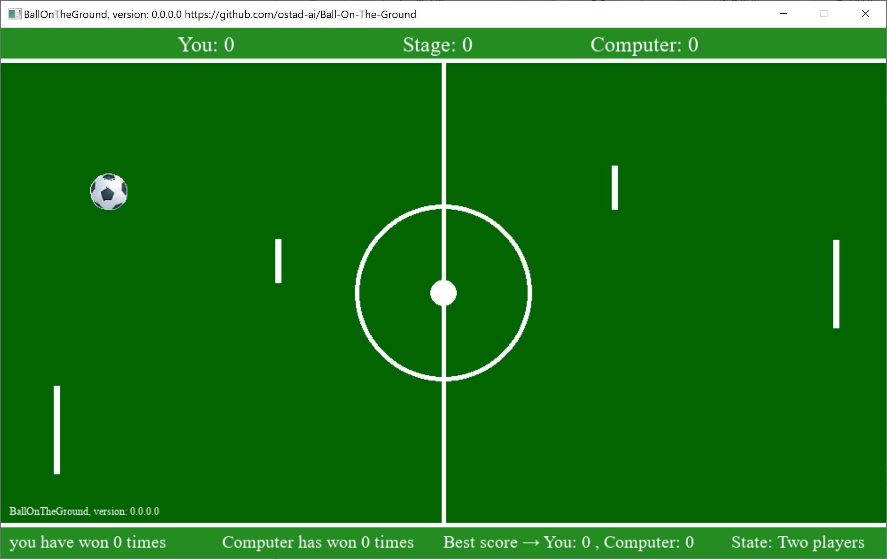

# BallOnTheGround
### Newest: version 0.0.0.0
1. A 2D Ball Game
2. You can play in two states: One-player each team, or two-player each team. You change this state by Space key.
## This archive includes the executable program, ballontheground.exe, which you should click on to run.
[Download the archive for win64](https://drive.google.com/file/d/1hdcvTZb5CB8FQjQBpcne7LtNHwUvDqQs/view?usp=sharing)
---
 *Figure 1: A snapshot of Ball-On-The-Ground while playing the game.*
---